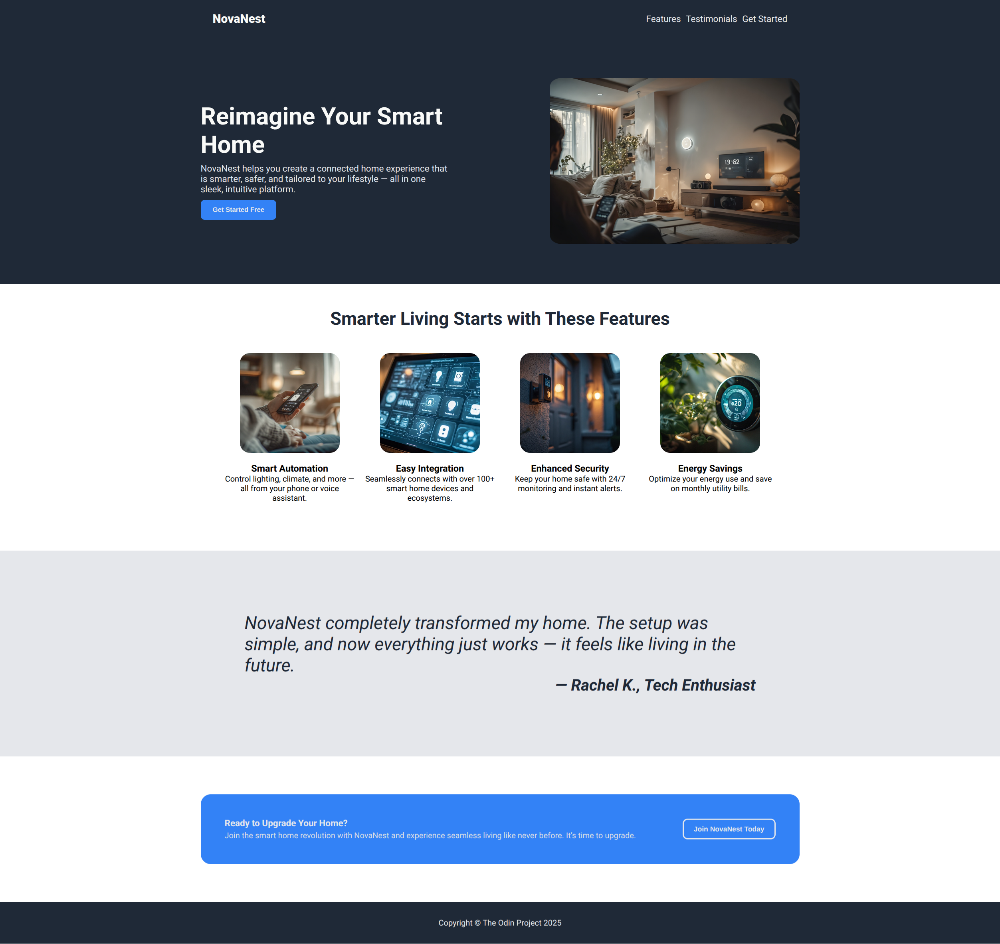

# Landing page project

This is a simple static landing page created as a part of [The Odin Project's Foundations Course.](https://www.theodinproject.com/lessons/foundations-landing-page)

## Screenshots

## What I learned

- Improve my understanding of the Flexbox layout
- Prompting LLMs to generate data about a fictional company that I created the landing page for.

## Challenges Faced

- Naming classes and structuring my CSS
- I still don't understand some weirds behaviors when trying to size Flexbox items.

## Future Improvements

- Make it fully responsive
- Better hover effects and adding transitions
- Applying a CSS convention to name classes and structure the CSS

## License

This project is part of an educational curriculum and is free to use and modify for learning purposes.
